# Customer Analytics & Churn Prediction Platform

A production-ready analytics platform that transforms raw e-commerce transaction data into actionable business insights using SQL, Python, and Machine Learning.

## What This Project Does

Imagine you're running an online store with thousands of customers. This platform helps you answer critical questions:
- **Who are my most valuable customers?** (RFM Segmentation)
- **Who is about to leave?** (Churn Prediction with ML)
- **How much revenue is at risk?** (Financial Impact Analysis)
- **What should I do about it?** (Actionable Recommendations)

---

## Live Demo


---

## System Architecture


---

## Data Model

```mermaid
erDiagram
    TRANSACTIONS {
        int id PK "Auto-increment ID"
        string transaction_id "Invoice Number"
        int customer_id "Unique Customer ID"
        string stock_code "Product Code"
        string description "Product Name"
        int quantity "Items Purchased"
        float unit_price "Price per Unit"
        float amount "Total = Quantity × Price"
        datetime transaction_date "Purchase Timestamp"
        string country "Customer Location"
    }
```



**Key Design Decision**: We use a single fact table (transactions) instead of normalized tables because:
- Faster analytical queries (no joins needed)
- Simpler data pipeline
- Follows data warehouse best practices for OLAP workloads

---

## Features

### 1. Executive Summary Dashboard
- **KPI Cards** with month-over-month trends
- **Revenue at Risk** calculation
- **Interactive Scenario Modeling** ("What if we reduce churn by 10%?")
- **Strategic Recommendations** based on actual data

### 2. Customer Segmentation
- **RFM Analysis**: Segments customers into Champions, Loyal, At Risk, etc.
- **Cohort Analysis**: Retention heatmap showing customer lifecycle
- **Visual Clustering**: Interactive scatter plots with segment colors

### 3. Churn Prediction (Machine Learning)
- **Random Forest Model** trained on 3,370 customers
- **Feature Importance** analysis
- **Risk Scoring**: High/Medium/Low risk categories
- **CSV Export** of at-risk customers for CRM integration

---

## Tech Stack

| Layer | Technology | Why? |
|-------|-----------|------|
| **Data Source** | UCI ML Repository | Real-world e-commerce data |
| **Storage** | SQLite | Lightweight, serverless, ACID-compliant |
| **ETL** | Pandas + SQLAlchemy | Industry-standard Python tools |
| **Analytics** | SQL + Pandas | Efficient aggregations |
| **ML** | Scikit-learn (Random Forest) | Proven algorithm for tabular data |
| **Visualization** | Streamlit + Plotly | Interactive, presentation-ready |

---

## Quick Start

### Prerequisites
- Python 3.8+
- 100 MB free disk space

### Installation

1. **Clone the repository**
   ```bash
   git clone https://github.com/yourusername/customer-analytics-platform.git
   cd customer-analytics-platform
   ```

2. **Install dependencies**
   ```bash
   pip install -r requirements.txt
   ```

3. **Run the data pipeline**
   ```bash
   python src/database_setup.py
   ```
   This will:
   - Download the UCI Online Retail dataset (~20 MB)
   - Clean the data (remove cancellations, handle nulls)
   - Load 397,924 transactions into SQLite

4. **Train the ML model**
   ```bash
   python src/model.py
   ```
   Output: `data/churn_model.pkl` (trained Random Forest)

5. **Launch the dashboard**
   ```bash
   streamlit run app.py
   ```
   Open your browser to `http://localhost:8501`

---

## Project Structure

```
customer_analytics_platform/
│
├── app.py                      # Streamlit dashboard entry point
├── requirements.txt            # Python dependencies
├── README.md                   # You are here
│
├── src/
│   ├── database_setup.py       # ETL: Download → Clean → Load
│   ├── analysis.py             # RFM, Cohort, Revenue metrics
│   └── model.py                # ML: Feature engineering + training
│
├── data/
│   ├── .gitkeep                # Preserves directory in Git
│   ├── online_retail.xlsx      # Raw data (excluded from Git)
│   ├── customer_analytics.db   # SQLite database (excluded)
│   └── churn_model.pkl         # Trained model (excluded)
│
└── .gitignore                  # Excludes large files from Git
```

**Note**: Large data files are excluded from Git. Run `database_setup.py` to generate them locally.

---

## Key Insights from the Data

Based on the UCI Online Retail dataset (2010-2011):

- **Total Revenue**: £8.9M from 4,372 customers
- **Top Segment**: Champions (12% of customers) drive 45% of revenue
- **Churn Risk**: 23% of customers are "At Risk" or "Lost"
- **Retention**: Drops to 35% after Month 1 (opportunity for onboarding campaigns)

---

## Business Impact

### Before This Platform
❌ No visibility into customer health  
❌ Reactive approach to churn  
❌ Marketing budget spread evenly  

### After This Platform
✅ Identify top 12% of customers driving 45% of revenue  
✅ Predict churn 90 days in advance  
✅ Focus retention budget on high-value "At Risk" customers  
✅ Model ROI of churn reduction campaigns  

**Estimated Impact**: Reducing churn by 10% could save £200K+ in revenue.

---

## Skills Demonstrated

This project showcases:

- **Data Engineering**: ETL pipelines, data cleaning, schema design
- **SQL**: Aggregations, window functions, date manipulation
- **Python**: Pandas, SQLAlchemy, object-oriented design
- **Machine Learning**: Feature engineering, Random Forest, model evaluation
- **Statistics**: RFM scoring, cohort analysis, percentile calculations
- **Visualization**: Streamlit, Plotly, dashboard design
- **Business Acumen**: Translating data into actionable insights

---

## Future Enhancements

- [ ] Add PostgreSQL support for production deployment
- [ ] Implement A/B testing framework for campaign effectiveness
- [ ] Build REST API for CRM integration
- [ ] Add real-time data streaming with Apache Kafka
- [ ] Deploy to AWS/GCP with Docker + Kubernetes

---

## License

MIT License - feel free to use this for learning or commercial projects.

---

## Contact

**Your Name**  
📧 your.email@example.com  
🔗 [LinkedIn](https://linkedin.com/in/yourprofile)  
💼 [Portfolio](https://yourportfolio.com)

---

## Acknowledgments

- **Dataset**: [UCI Machine Learning Repository](https://archive.ics.uci.edu/ml/datasets/Online+Retail)
- **Inspiration**: Real-world e-commerce analytics challenges
- **Tools**: Built with ❤️ using Python, Streamlit, and Scikit-learn
